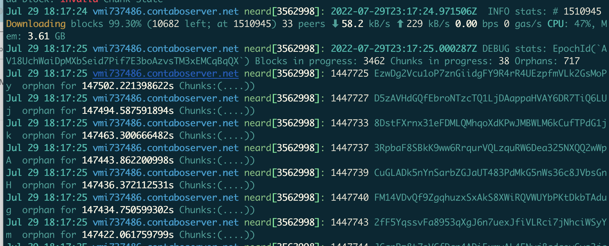

This article is for Near Stake Wars challenge 005
There are totally 9 challenges, the period is from 7/13 to 9/7

You can check challenges: https://github.com/near/stakewars-iii/blob/main/challenges/challenge-summary.md

## step one
https://github.com/near/stakewars-iii/blob/main/challenges/001.md
* The first step is Create your Shardnet wallet & deploy the NEAR CLI
* I create the shardnet wallet with ID: omega.shardnet.near
* After create the wallet, I saw there are some tokens exist, I was surprised. Cause I thought I can swap to USDT.

* But I soon notice that this is test-only wallet.

## step two
https://github.com/near/stakewars-iii/blob/main/challenges/002.md
* First I check my hardware of VPS match the requirement.
* Then I download softwares & set the configuration
* Authorize Wallet, when I run "near login" command launches a web browser. I copy the url and Grant Access
* I come back to console, input my wallet & 'pool_id'
* Finially my Validator node start to run

## step three
https://github.com/near/stakewars-iii/blob/main/challenges/003.md
* I just follow the commands to deploy my staking pool, then I use below url can find my staking pool:
https://explorer.shardnet.near.org/nodes/validators

## step four
https://github.com/near/stakewars-iii/blob/main/challenges/004.md
* This step is for some commands to check Validator node logs.

